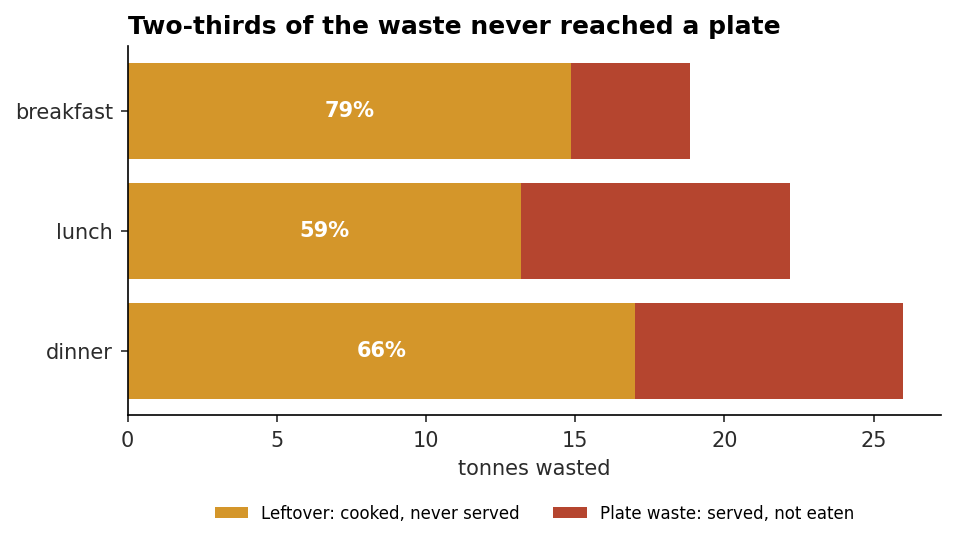
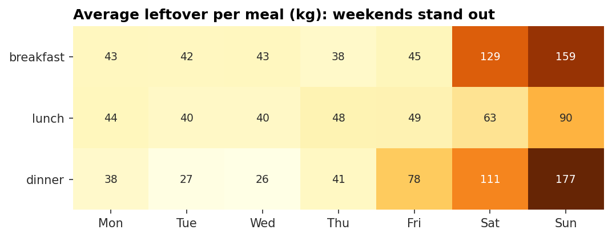
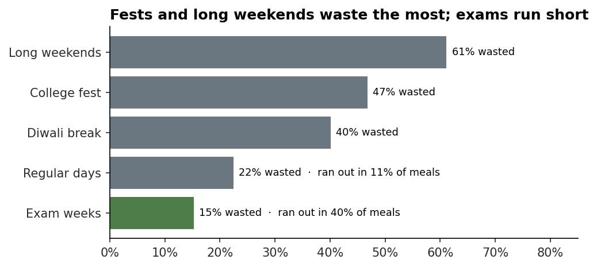
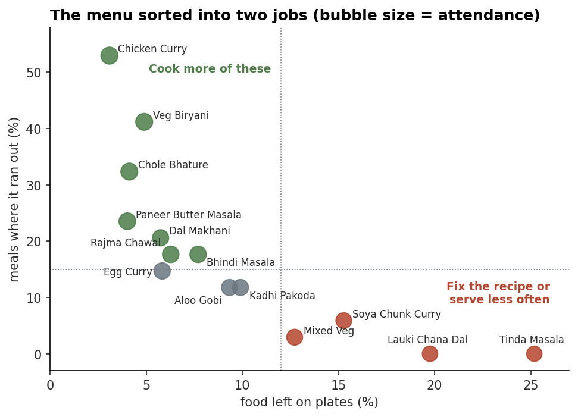
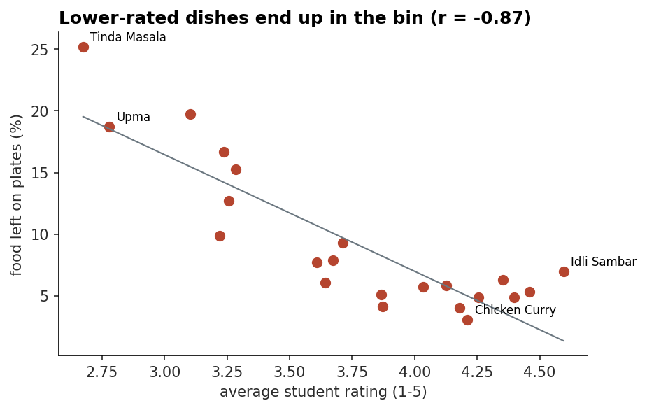
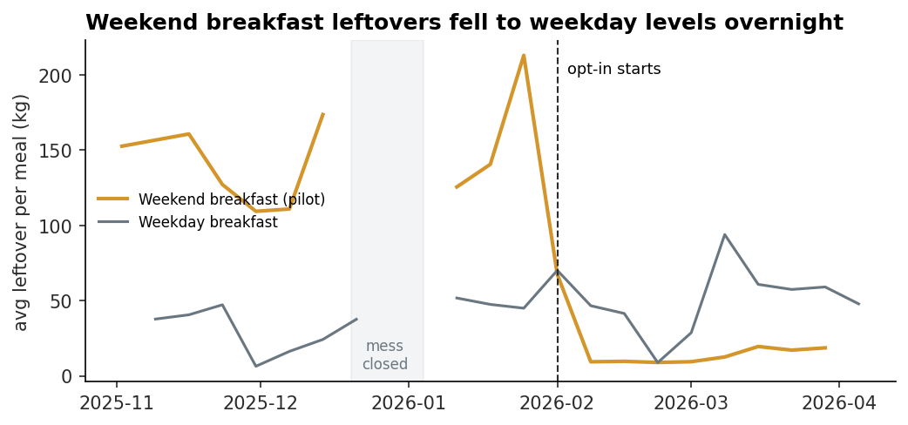

# Plate to Bin 🍛 → 🗑️
### Where does a hostel mess's food go, and how much of it can be saved?

A 1,200-student hostel mess cooks about **1.2 tonnes of food a day**. Students complain that the good dishes run out, the mess committee complains about rising costs, and nobody actually knows how much food ends up in the bin.

This project follows one academic year (Jul 2025 to Mar 2026) of the mess's kitchen log, 714 meals, to answer five questions:

1. How much food is wasted, and what does it cost?
2. Is it a **cooking** problem (too much made) or an **eating** problem (left on plates)?
3. Which days, meals, campus events and dishes drive it?
4. Did the weekend-breakfast **opt-in pilot** started in Feb 2026 actually work?
5. What should change, and how much would that save?

**Tools:** Python (pandas, matplotlib) · SQL (SQLite: joins, CTEs, window functions) · Jupyter · Streamlit + Plotly dashboard

---

## Key findings

**1. 23.5% of all food cooked was thrown away, about ₹46.5 lakh in eight months.** And yet food *ran out* in 1 meal out of 7. Wasting food and running out at the same time points to a planning problem, not a quantity problem.

**2. Two-thirds of the waste never reached a plate.** Most of it is leftover food that was cooked and never served, which the kitchen can fix without changing a single recipe.



**3. Weekends are the biggest leak.** The kitchen cooks for ~70% of students at every breakfast, but only ~30% turn up on Saturday and Sunday mornings. Sunday dinner has the same problem as students order in.



**4. The kitchen ignores the academic calendar (except Diwali).** Over half the food is wasted on fest days and long weekends, while during exams students stay in and food runs out in 4 of 10 meals. Rainy days do the same: attendance rises and the kitchen runs out four times as often.



**5. The menu needs two different fixes.** Popular dishes (Chicken Curry, Veg Biryani, Chole Bhature) run out in a third to half of meals. Unpopular ones (Tinda Masala, Lauki Chana Dal, Upma) lose a fifth to a quarter of every plate.



**6. Student ratings predict plate waste (r = −0.87).** The QR-code feedback form, which only ~1% of students fill in, is already a reliable early-warning signal.



**7. The opt-in pilot worked: ~140 kg less leftover per weekend breakfast (~90%).** Measured with a simple difference-in-differences against weekday breakfasts, so the exam and Holi months don't distort the result.



---

## Recommendations

| # | Change | Est. saving / year |
|---|---|---|
| 1 | Make the night-before opt-in permanent for weekend breakfasts and extend it to Sunday dinner | ₹7.9 lakh |
| 2 | Cook to the academic calendar: −40–50% on fest and long-weekend days, +10% at exam-week dinners | ₹3.4 lakh |
| 3 | Rework or rotate out the 4 most-wasted dishes | ₹1.5 lakh |
| 4 | Add a +10% buffer for the 3 most popular dishes and for rainy days | fewer "food over" complaints |
| 5 | Flag any new dish rated below 3.3 in its first two weeks | early warning |

**Total: about ₹12.8 lakh a year, roughly 27% of current waste**, without cooking less of what students actually eat. The assumptions behind each number are in section 8 of the notebook.

---

## How I did it

```
simulate_data.py  →  clean_data.py  →  load_to_sqlite.py  →  business_questions.sql
   (raw, messy)       (fix + audit)       (SQLite DB)          (10 questions)
                            ↓
              mess_waste_analysis.ipynb  →  dashboard/app.py
                 (analysis + charts)         (for the committee)
```

1. **Data cleaning.** The raw log has the problems a real kitchen log would: two date formats, 26 spellings of 22 dishes, duplicate rows, values typed in grams instead of kg, and missing weights from days the scale was broken. Every fix is scripted and printed as an audit report. Missing plate waste is filled using *that dish's* median, not a global average.
2. **SQL.** Normalised tables (meals, dishes, calendar, feedback) with 10 business questions using joins, CTEs, `RANK()` and `LAG()`. Run them all with `python src/run_sql.py`.
3. **Analysis.** Separated waste into leftover vs plate waste (the key framing), then looked at day, meal, event, weather and dish. Used difference-in-differences to measure the pilot fairly.
4. **Dashboard.** A Streamlit app with filters by date, meal and campus event so the mess committee can check any week themselves.

---

## About the data

Mess records aren't public, so the dataset is **simulated** by `src/simulate_data.py`. Every assumption (attendance rates, portion sizes, the kitchen's fixed cooking rule, dish popularity, cost per kg) is written out as a plain number at the top of that file, so anyone can question or change it. The patterns are realistic; the exact rupee figures are illustrative.

The whole pipeline runs unchanged on **real data with the same columns**. If you can get even two weeks of weighing logs from your own mess, drop them into `data/raw/` and re-run.

| Table | Rows | What it holds |
|---|---|---|
| `meal_log_raw.csv` | 726 | One row per meal: dish, headcount, kg cooked, kg leftover, kg plate waste, ran out (Y/N) |
| `dishes.csv` | 22 | Dish, veg / egg / non-veg, cost per kg (₹) |
| `academic_calendar.csv` | 238 | Day of week, campus event, weather |
| `student_feedback.csv` | 7,002 | 1–5 ratings and short comment tags from a QR-code form |

**Two kinds of waste:** *leftover* is food cooked but never served (a planning problem); *plate waste* is food served but not eaten (a taste or portion problem).

---

## Run it yourself

```bash
git clone https://github.com/aryan-novice/plate-to-bin.git
cd plate-to-bin
pip install -r requirements.txt

python src/simulate_data.py     # 1. generate the raw (messy) data
python src/clean_data.py        # 2. clean it + print an audit report
python src/load_to_sqlite.py    # 3. build data/mess.db
python src/run_sql.py           # 4. answer the 10 SQL questions

jupyter notebook notebooks/mess_waste_analysis.ipynb   # 5. full analysis
streamlit run dashboard/app.py                         # 6. dashboard
```

The cleaned data and the database are already committed, so you can skip straight to steps 4–6.

## Project structure

```
plate-to-bin/
├── data/
│   ├── raw/                  messy source files
│   ├── processed/            cleaned, analysis-ready CSVs
│   └── mess.db               SQLite database
├── src/
│   ├── simulate_data.py      generates the dataset (all assumptions documented)
│   ├── clean_data.py         cleaning with an audit report
│   ├── load_to_sqlite.py     builds the database from sql/schema.sql
│   └── run_sql.py            runs every SQL question and prints the answers
├── sql/
│   ├── schema.sql
│   └── business_questions.sql
├── notebooks/
│   └── mess_waste_analysis.ipynb
├── dashboard/
│   └── app.py
└── reports/figures/          charts used in this README
```

## Limitations

- Simulated data: patterns are realistic, rupee figures are illustrative.
- One cost per kg per dish; real ingredient prices change with the season.
- The pilot has about 17 weekend breakfasts behind it, which is enough to see a large effect but worth re-checking after a full semester.
- 17 plate-waste values were imputed, not measured (flagged in the `plate_waste_imputed` column).
